# 🔥Near Real–time Validation in a Wildfire Digital Twin 🔥

Validation is a key component of our NASA FireSense project developing a Wildfire Digital Twin. We provided a means to compare wildfire simulation results to real-world physical observations

---
### 🧮 The Classical Approach

A **classical approach** estimates real-world burn severity using multiband spectral images captured by Landsat satellites. This method first calculates the Normalized Burn Ratio (NBR) as the difference between the near infrared (NIR) and short wavelength infrared (SWIR) channels divided by their sum:

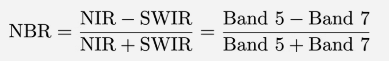

Large NBR values indicate healthy vegetation while small values indicate bare ground or recent fire damage.

Below is the examples for pre and post-fire NBR images:

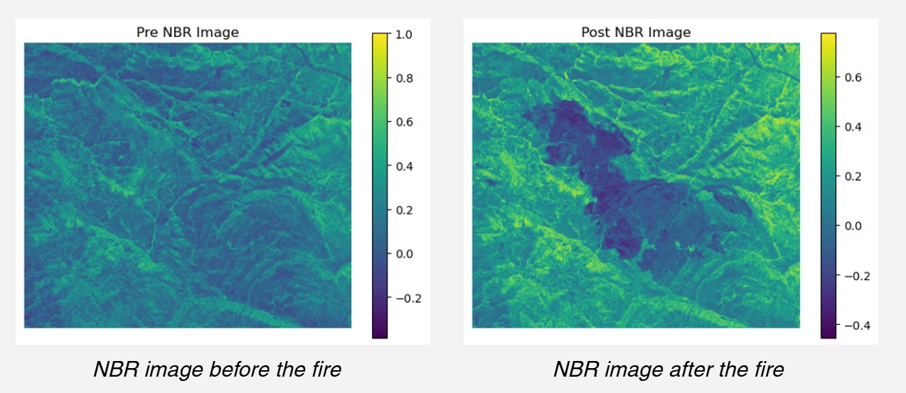

Next, the **delta Normalized Burn Ratio (dNBR)** index is computed by subtracting post-fire NBR from pre-fire NBR; higher dNBR values indicate more severe fire damage and lower dNBR values suggest vegetation regrowth.

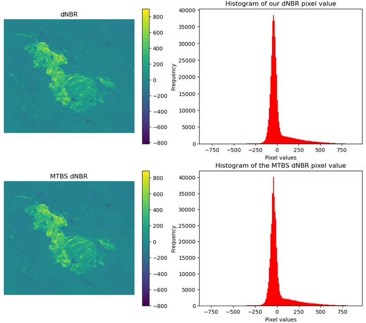

*We were able to reverse engineered the dNBR from the Monitoring Trends in Burn Severity (MTBS).*

However, this classical approach requires identifying pre- and post-fire image pairs, which is a very challenging task to automate.

---
### 🛰️ USGS Burn Probability Product

More recently, USGS has developed and begun providing **Burned Probability (BP)** products from Landsat data. These products are generated by applying sophisticated algorithms to Landsat data. *This obviates the need to identify pre-fire images by taking advantage of the entire history of a Landsat tile to determine natural variation in spectral reflectance in the absence of fires.*

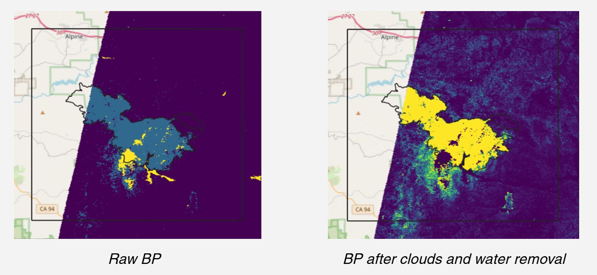

Unfortunately, there are two significant limitations of the USGS BP maps that frustrate the goals of our project: **time delays and geographic restrictions**

---
### 🤖 The Machine Learning Approach

We casted our problem of estimating BP from Landsat data as an image transformation problem where we applied pix2pix, a conditional GAN that has been proved to perform extremely well on these exact image transformation problems.

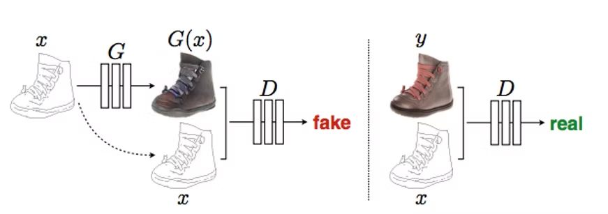
*pix2pix model, source: [Image-to-Image Translation with Conditional Adversarial Networks](https://arxiv.org/pdf/1611.07004)*

Input NBR images were scaled and shifted to help the model perform better, creating a intermediate product that we would like to call nNBR. Clouds and water pixels were also removed to reduce noises. 

*nNBR image of the AUGUST COMPLEX Fire* (5000x5000)

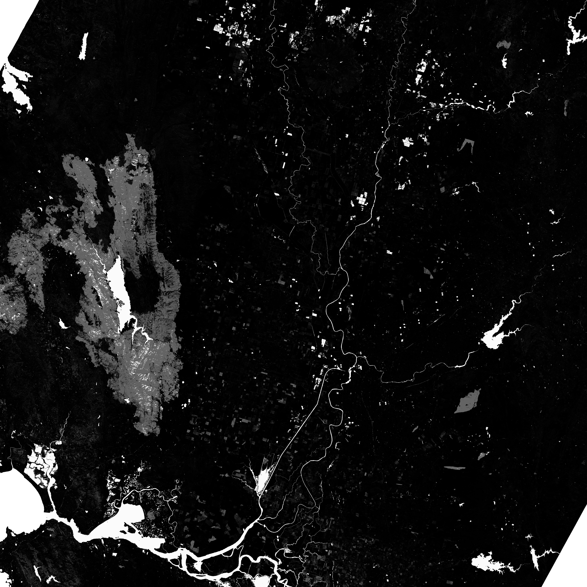
*Burn Probability map of the AUGUST COMPLEX Fire*

Because of the huge dimension of Landsat data (5000 x 5000), we broke down the input into pairs of patches of 256 x 256 to make the training more feasible:

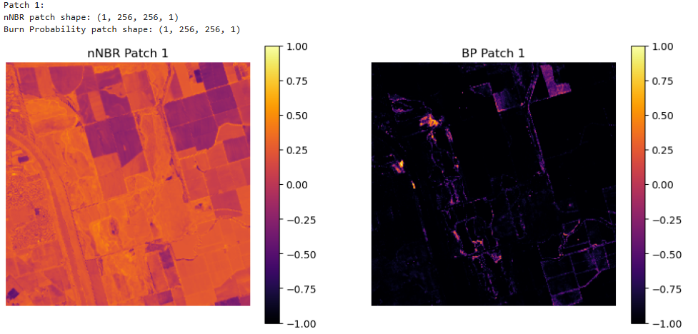

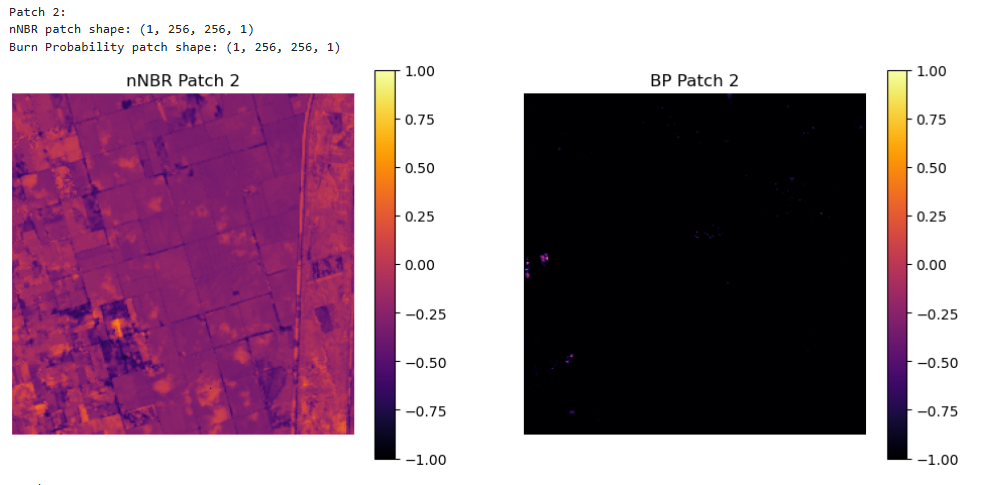

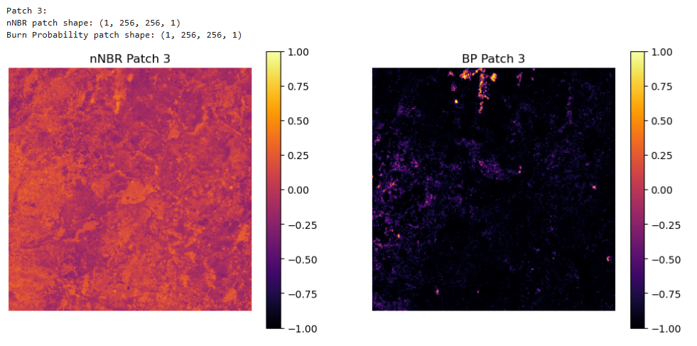

---
### 📑 Initial Results

After running a good number of experiments, we ended up training a working model, which we then tested on the same scene but different date. Here are some sample results:

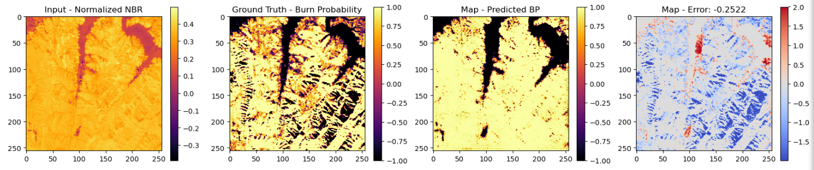
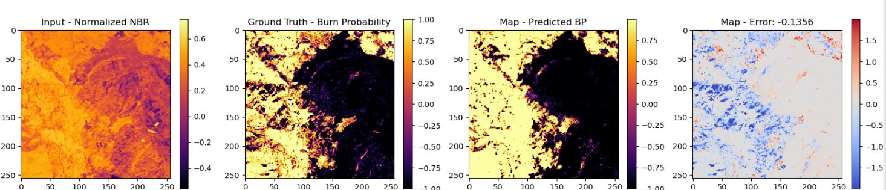
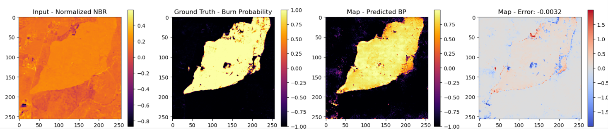

We then ran the model on the Palisades Fire, California to test the generalization of the model, and at first glance, the results looked promising:

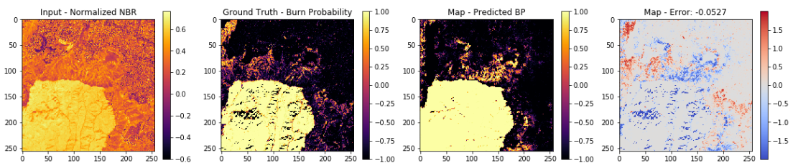
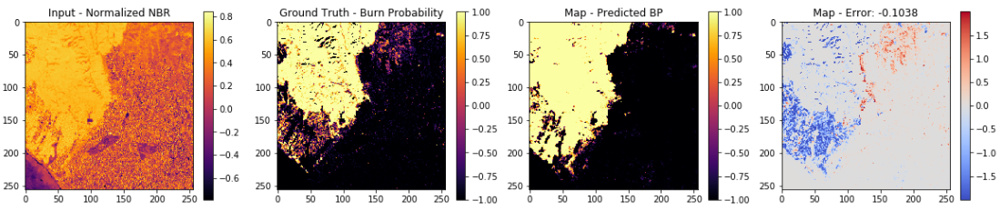
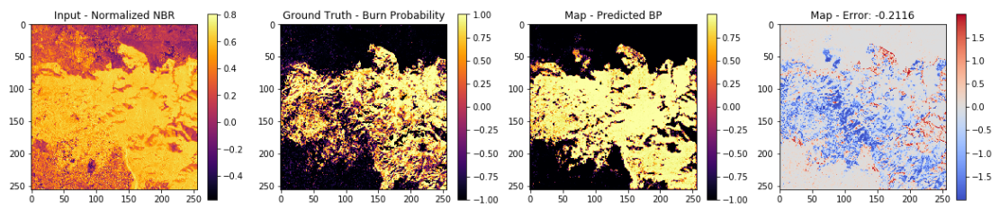

For better visualization, we re-assembled these 256x256 output images. Next, we ran the assembled image through a C++ program to colormap images with values in the range [0,100] and masked values above 101:

So we have the input of as nNBR:

<!-- AUGUST COMPLEX FIRE -->

<em>nNBR of the AUGUST COMPLEX Fire</em>

And the BP as the ground truth:

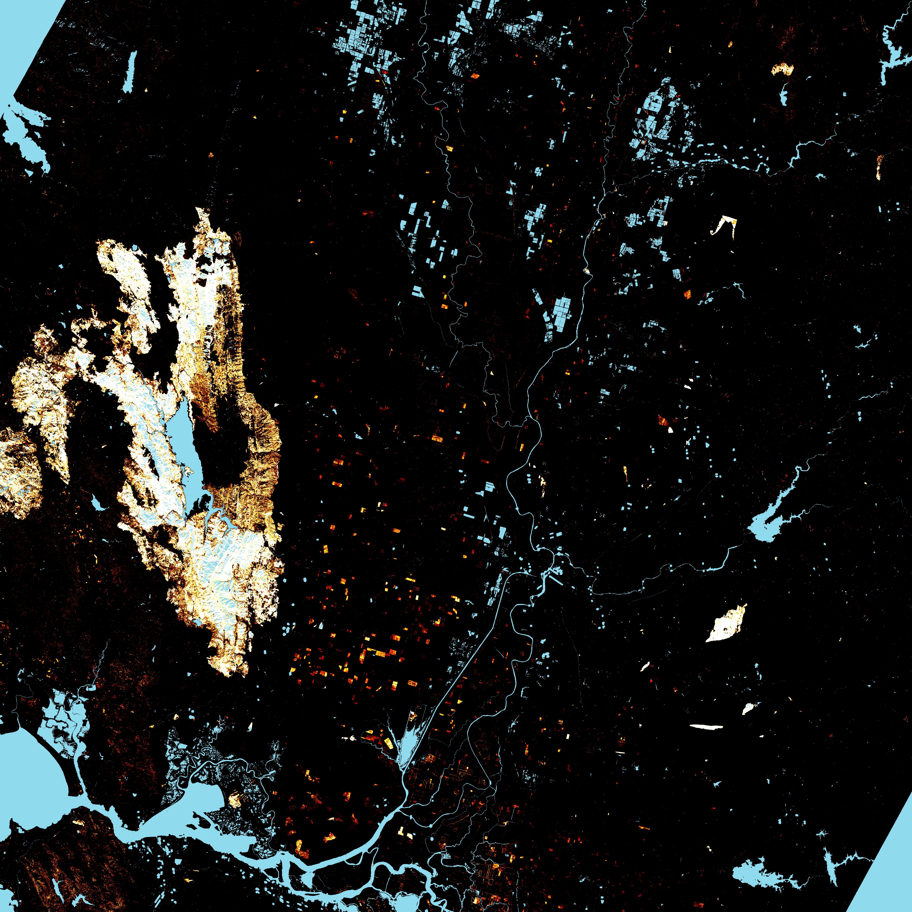

<em>Burn Probability of the AUGUST COMPLEX Fire (Ground Truth)</em>

This is the model's output:

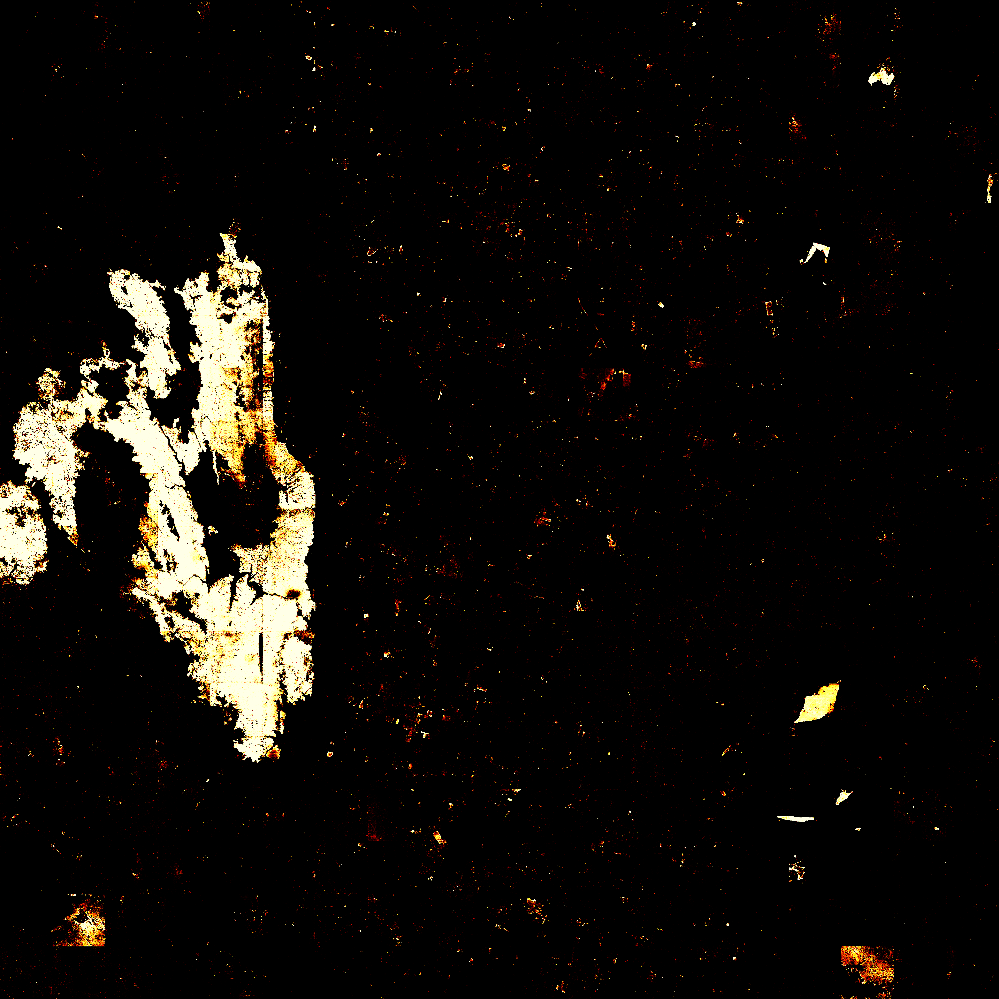

<em>Model Output for Burn Probability Prediction (AUGUST COMPLEX Fire)</em>

<!-- PALISADES FIRE -->

We also assembled the Palisades Fire scene and colormapped the full image:

<em>nNBR of the PALISADES Fire in California</em>

And the BP as the ground truth:

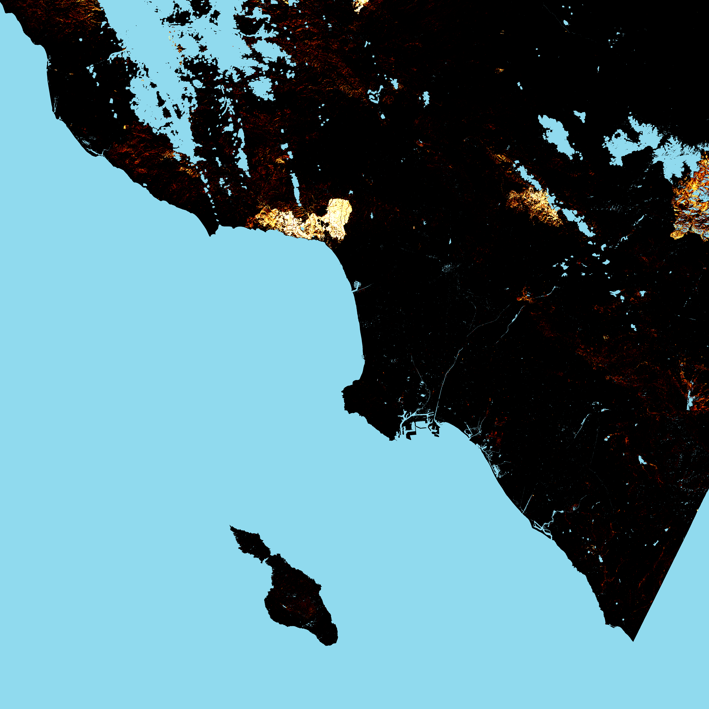

<em>Burn Probability of the PALISADES Fire (Ground Truth)</em>

This is the model's output:

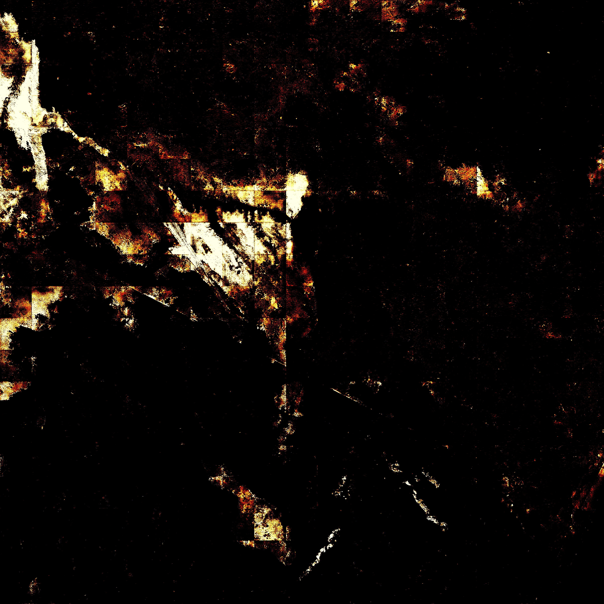

<em>Model Output for Burn Probability Prediction (PALISADES Fire)</em>

